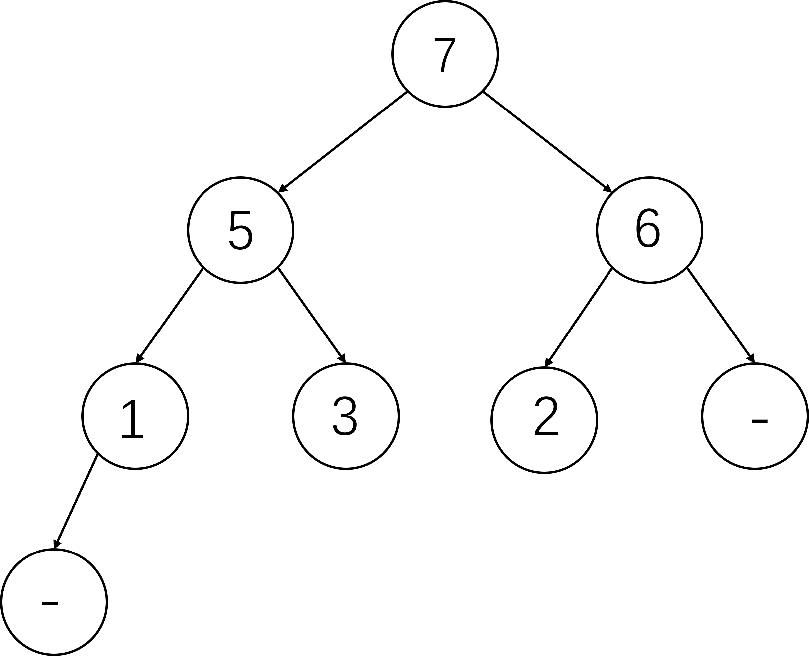

# 数据结构与算法作业  2024/11/1

## 1.(P280.T15)

解：数组[-,5,7,2,9,3,8,6,1]对应的完全二叉树如下图：

该二叉树堆化后形成的堆如下：

下面，我们一步步的将根元素弹出，并压入数组中：

Step 1：形成数组[9]

Step 2：形成数组[9,8]

Step 3：形成数组[9,8,7]

Step 4：形成数组[9,8,7,6]

Step 5：形成数组[9,8,7,6,5]

Step 6：形成数组[9,8,7,6,5,3]

Step 7：形成数组[9,8,7,6,5,3,2]

Step 8：形成数组[9,8,7,6,5,3,2,1]

最终，我们完成堆排序，排序结果为：[9,8,7,6,5,3,2,1]